# Submission and Job State Model - Visual Diagrams

**Version**: 3.0 (Simplified Status Model)
**Last Updated**: February 2026

This document contains Mermaid state diagrams for the submission and job state workflows.

> **For Users**: Looking for a simpler overview? See [STATE_MODEL_USER_GUIDE.md](STATE_MODEL_USER_GUIDE.md)
>
> **This Document**: Complete technical diagrams for all state transitions and workflows
>
> **Note**: These diagrams render in GitHub, GitLab, and any Markdown viewer that supports Mermaid.

## Table of Contents

- [Simplified State Model Overview](#simplified-state-model-overview) - Key concepts
- [Complete Submission State Diagram](#complete-submission-state-diagram) - All 5 submission statuses
- [Complete Job State Diagram](#complete-job-state-diagram) - All 3 job states
- [Combined System Flow](#combined-system-flow) - Jobs + Submissions together
- [Individual Workflows](#submission-lifecycle-by-action) - Detailed flow charts
- [State Transition Matrix](#state-transition-matrix) - Reference table

---

## Simplified State Model Overview

### Key Concepts

The V3 state model simplifies submission status from 8 states to **5 statuses**:

1. **Stage is derived from Job.status**, not stored in submission
   - Submission's `status` field only tracks the action/visibility
   - Whether a submission is in "draft" or "submitted" stage comes from the parent Job

2. **Pending statuses (action-based)**:
   - `new` - New submission awaiting first release
   - `republish` - Update to existing submission awaiting release
   - `unpublish` - Submission marked for unpublishing

3. **Released statuses (visibility-based)**:
   - `published` - Published and visible to public
   - `unpublished` - Unpublished and hidden from public

### Status vs Stage

| Submission Status | Job Status = draft | Job Status = submitted |
|-------------------|-------------------|------------------------|
| `new` | Draft new | Submitted new |
| `republish` | Draft republish | Submitted republish |
| `unpublish` | Draft unpublish | Submitted unpublish |
| `published` | N/A (not in job) | N/A (not in job) |
| `unpublished` | N/A (not in job) | N/A (not in job) |

---

## Combined System Flow

This diagram shows how jobs and submissions work together in the complete workflow.

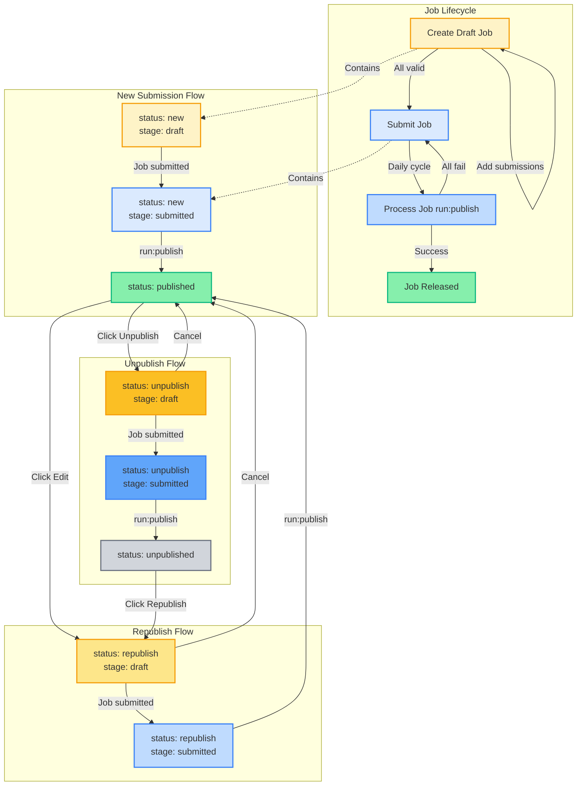

**Legend:**

- 🟡 **Yellow** = Draft stage (editable)
- 🔵 **Blue** = Submitted stage (awaiting processing)
- 🟢 **Green** = Published/Released (active/complete)
- ⚫ **Gray** = Unpublished (hidden)

---

## Complete Submission State Diagram

This diagram shows all possible state transitions for submissions in the V3 (simplified) state machine.

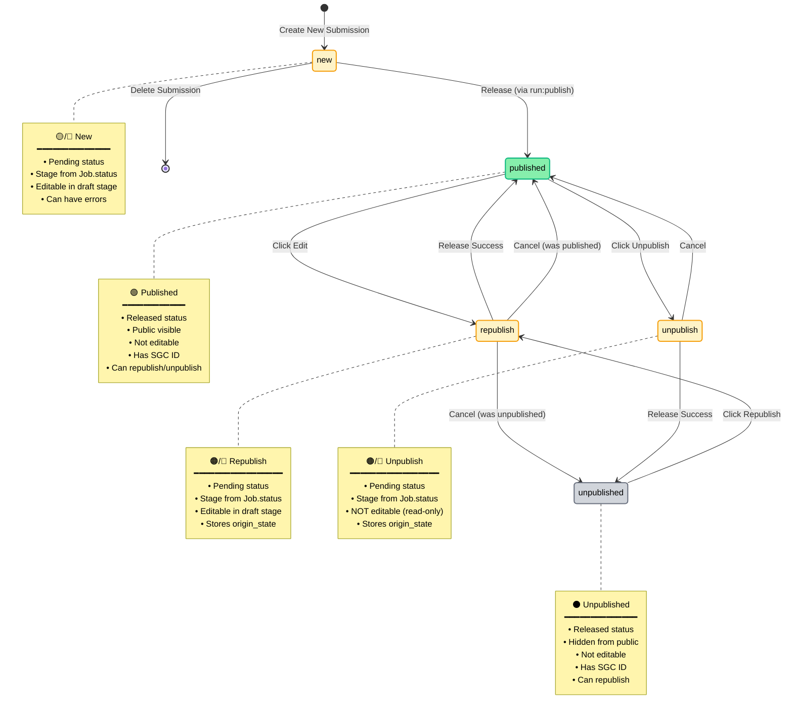

## New Submission Workflow

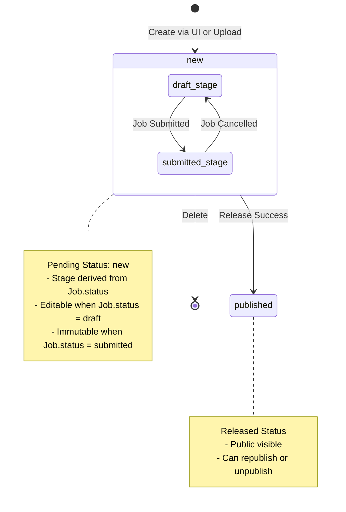

## Republish Workflow

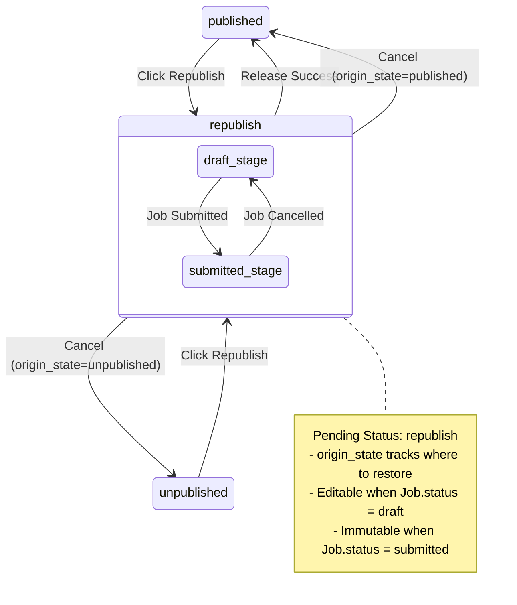

## Unpublish Workflow

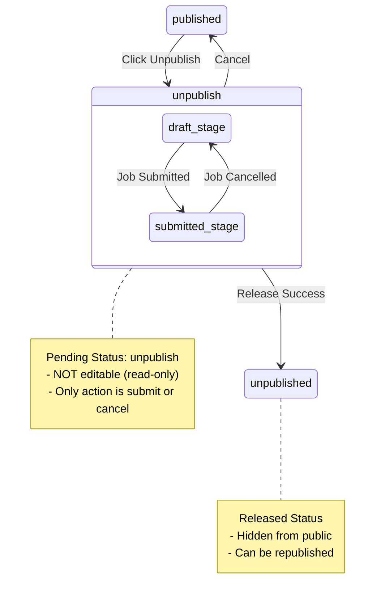

## Complete Job State Diagram

This diagram shows all possible state transitions for jobs in the V3 state machine.

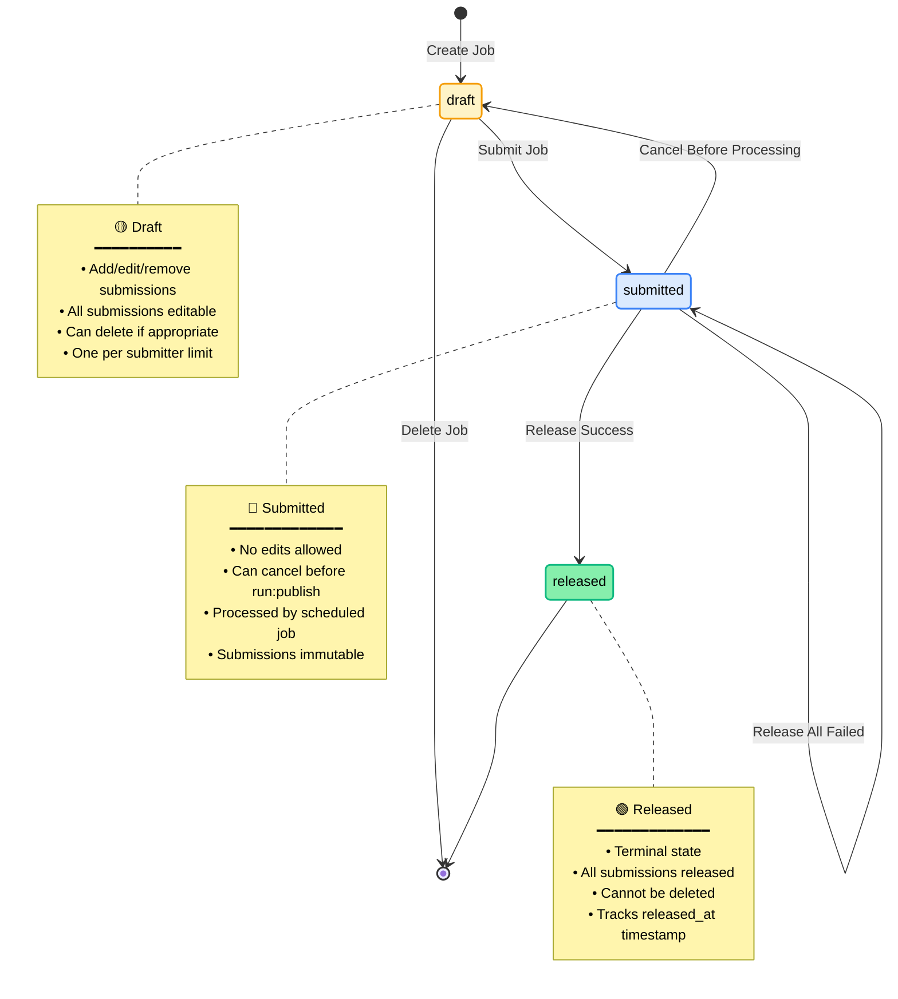

## Job State with Failure Handling

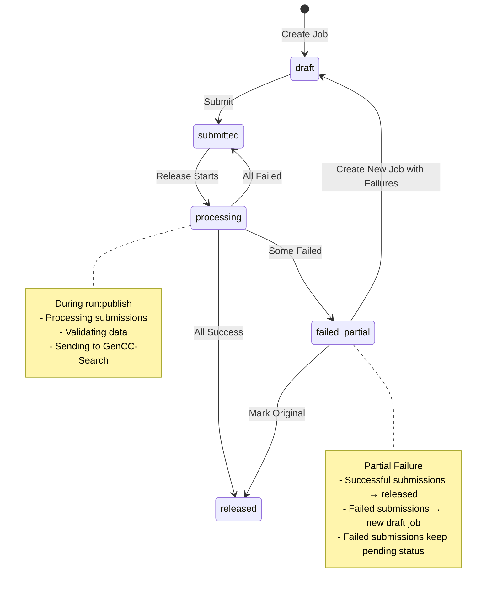

## Submission Lifecycle by Action

### Create New Submission

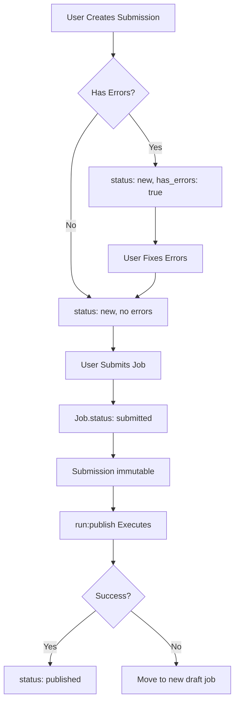

### Republish Existing Submission

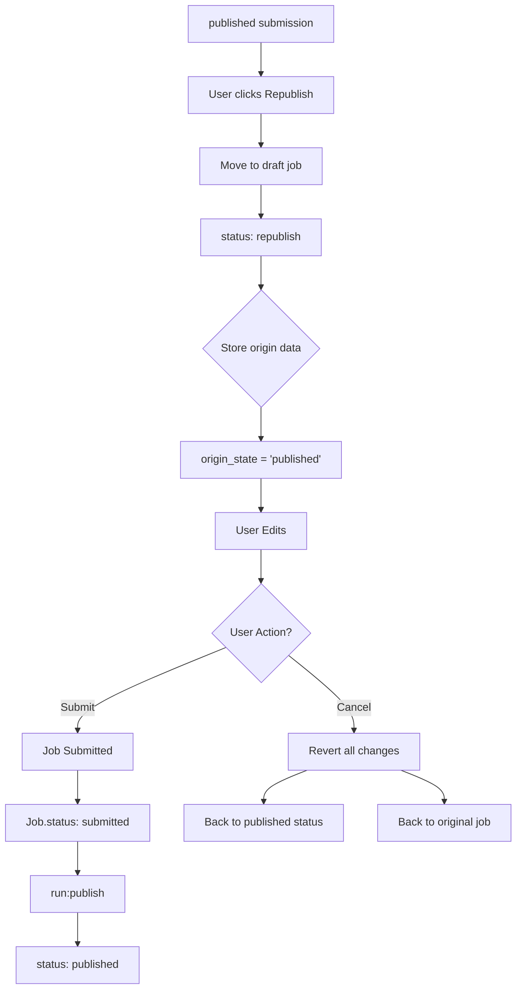

### Unpublish Submission

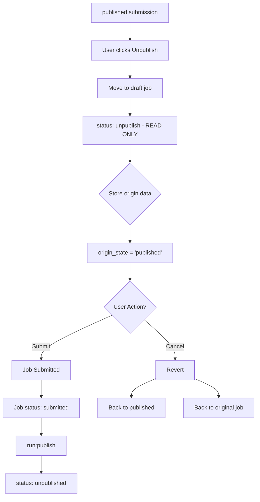

## Job Lifecycle

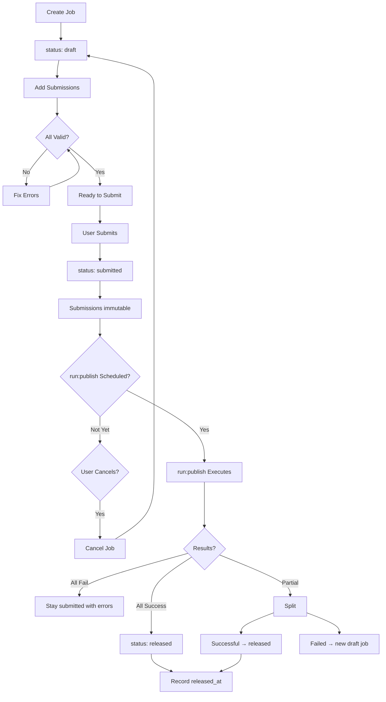

## State Transition Matrix

### Submission Statuses

| From Status | To Status(es) | Trigger | Validation |
|-------------|---------------|---------|------------|
| `new` | `published` | run:publish success | In submitted job |
| `new` | DELETED | User deletes | In draft job |
| `published` | `republish` | User republishes | - |
| `published` | `unpublish` | User unpublishes | - |
| `republish` | `published` | run:publish success | In submitted job |
| `republish` | `published` | User cancels | origin_state='published' |
| `republish` | `unpublished` | User cancels | origin_state='unpublished' |
| `unpublish` | `unpublished` | run:publish success | In submitted job |
| `unpublish` | `published` | User cancels | - |
| `unpublished` | `republish` | User republishes | - |

### Job States

| From State | To State(s) | Trigger | Validation |
|------------|-------------|---------|------------|
| `draft` | `submitted` | User submits | All submissions valid, no errors |
| `draft` | DELETED | User deletes | Can delete if empty or only pending submissions |
| `submitted` | `released` | run:publish success | At least one submission succeeds |
| `submitted` | `submitted` | run:publish failure | All submissions fail |
| `submitted` | `draft` | User cancels | Before run:publish starts |

### Stage Derivation

The submission's "stage" (draft vs submitted) is determined by its parent Job:

| Job.status | Pending Submission Stage | Can Edit Submission? |
|------------|--------------------------|---------------------|
| `draft` | Draft | ✅ Yes (except unpublish) |
| `submitted` | Submitted | ❌ No (immutable) |
| `released` | N/A | N/A (submissions are released) |

## Color Coding Guide

### Submission Statuses

| Status | Color | Description |
|--------|-------|-------------|
| `new` (draft) | **Light Orange** (#FEF3C7) | New submission in draft job |
| `new` (submitted) | **Light Blue** (#DBEAFE) | New submission awaiting release |
| `republish` (draft) | **Medium Orange** (#FDE68A) | Editing published submission |
| `republish` (submitted) | **Medium Blue** (#BFDBFE) | Update awaiting release |
| `unpublish` (draft) | **Dark Orange** (#FBBF24) | Pending removal (read-only) |
| `unpublish` (submitted) | **Dark Blue** (#60A5FA) | Unpublish awaiting release |
| `published` | **Green** (#86EFAC) | Live/active submission |
| `unpublished` | **Dark Gray** (#3F3F46) | Removed/hidden |

### Job States

| State | Color | Description |
|-------|-------|-------------|
| `draft` | **Orange/Yellow** | Work in progress |
| `submitted` | **Blue** | Awaiting daily processing |
| `released` | **Green** | Completed processing |

## Glossary

- **Pending Status** (`new`, `republish`, `unpublish`): Submission awaiting release
- **Released Status** (`published`, `unpublished`): Submission has been released
- **Stage**: Derived from Job.status - either "draft" (editable) or "submitted" (immutable)
- **Origin State** (`origin_state`): Stored status for cancel operations (published/unpublished)
- **Immutable**: Cannot have fields edited - either released or in submitted job
- **run:publish**: Backend command that processes submitted jobs and releases submissions
- **Cancel**: Action to cancel draft changes and return submission to its original status and job
- **Republish**: Action to edit and re-publish an already published submission
- **Unpublish**: Action to remove a published submission from public view

---

## Related Documentation

- [STATE_MODEL_USER_GUIDE.md](STATE_MODEL_USER_GUIDE.md) - User-friendly guide with simple visual workflows
- [STATE_MODEL_QUICK_REFERENCE.md](STATE_MODEL_QUICK_REFERENCE.md) - Technical reference with code examples

---

**Version**: 3.0
**Last Updated**: February 2026
