# Submission and Job State Model - Visual Diagrams

**Version**: 2.0 (String-Based States)
**Last Updated**: November 13, 2025

This document contains Mermaid state diagrams for the submission and job state workflows.

> **For Users**: Looking for a simpler overview? See [STATE_MODEL_USER_GUIDE.md](STATE_MODEL_USER_GUIDE.md)
>
> **This Document**: Complete technical diagrams for all state transitions and workflows
>
> **Note**: These diagrams render in GitHub, GitLab, and any Markdown viewer that supports Mermaid.
> Colors and styling are defined using Mermaid's theming capabilities.

## Table of Contents

- [Complete Submission State Diagram](#complete-submission-state-diagram) - All 8 submission states
- [Complete Job State Diagram](#complete-job-state-diagram) - All 3 job states
- [Combined System Flow](#combined-system-flow) - Jobs + Submissions together
- [Individual Workflows](#submission-lifecycle-by-action) - Detailed flow charts
- [State Transition Matrix](#state-transition-matrix) - Reference table

---

## Combined System Flow

This diagram shows how jobs and submissions work together in the complete workflow.

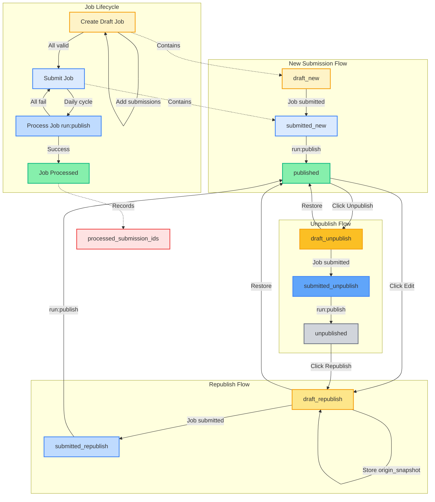

**Legend:**

- 🟡 **Yellow** = Draft states (editable)
- 🔵 **Blue** = Submitted states (awaiting processing)
- 🟢 **Green** = Published/Processed (active/complete)
- ⚫ **Gray** = Unpublished (hidden)

---

## Complete Submission State Diagram

This diagram shows all possible state transitions for submissions in the V2 state machine.

```mermaid
stateDiagram-v2
    [*] --> draft_new: Create New Submission

    draft_new --> submitted_new: Submit Job
    draft_new --> [*]: Delete Submission

    submitted_new --> published: Publish Success
    submitted_new --> draft_new: Restore Job

    published --> draft_republish: Click Edit
    published --> draft_unpublish: Click Unpublish

    draft_republish --> submitted_republish: Submit Job
    draft_republish --> published: Restore from published
    draft_republish --> unpublished: Restore from unpublished

    submitted_republish --> published: Publish Success
    submitted_republish --> draft_republish: Restore Job

    draft_unpublish --> submitted_unpublish: Submit Job
    draft_unpublish --> published: Restore

    submitted_unpublish --> unpublished: Unpublish Success
    submitted_unpublish --> draft_unpublish: Restore Job

    unpublished --> draft_republish: Click Republish

    note right of draft_new
        🟡 Draft New
        ━━━━━━━━━━━━━━
        • Editable
        • In draft job
        • Can have errors
        • Stores: origin_job_id
    end note

    note right of submitted_new
        🔵 Submitted New
        ━━━━━━━━━━━━━━━━
        • Not editable
        • In submitted job
        • No errors allowed
        • Awaits daily processing
    end note

    note right of published
        🟢 Published
        ━━━━━━━━━━━━
        • Public visible
        • Not editable
        • Has SGC ID
        • Can republish/unpublish
    end note

    note right of draft_republish
        🟠 Draft Republish
        ━━━━━━━━━━━━━━━━━
        • Editable
        • In draft job
        • Stores: origin_state,
          origin_snapshot,
          origin_job_id
    end note

    note right of draft_unpublish
        🟤 Draft Unpublish
        ━━━━━━━━━━━━━━━━━
        • Read-only
        • In draft job
        • Stores: origin_state,
          origin_job_id
    end note

    note right of unpublished
        ⚫ Unpublished
        ━━━━━━━━━━━━━━
        • Hidden from public
        • Not editable
        • Has SGC ID
        • Can republish
    end note

    classDef draftStyle fill:#FEF3C7,stroke:#F59E0B,stroke-width:2px,color:#000
    classDef submittedStyle fill:#DBEAFE,stroke:#3B82F6,stroke-width:2px,color:#000
    classDef publishedStyle fill:#86EFAC,stroke:#10B981,stroke-width:2px,color:#000
    classDef unpublishedStyle fill:#D1D5DB,stroke:#6B7280,stroke-width:2px,color:#000

    class draft_new,draft_republish,draft_unpublish draftStyle
    class submitted_new,submitted_republish,submitted_unpublish submittedStyle
    class published publishedStyle
    class unpublished unpublishedStyle
```

## New Submission Workflow

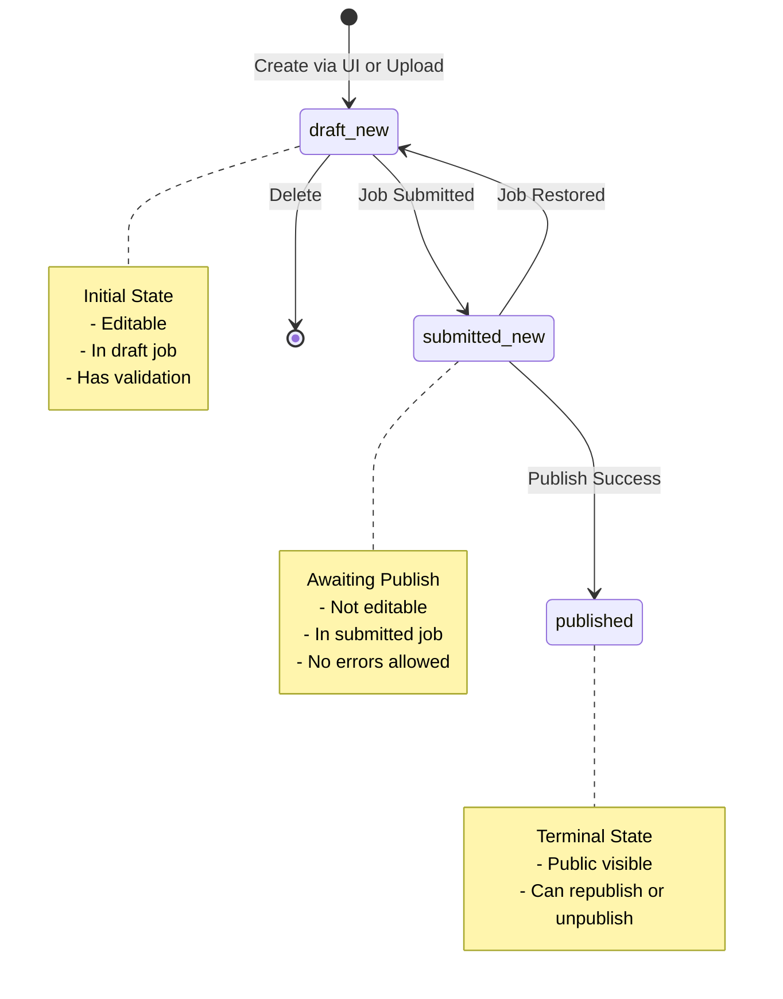

## Republish Workflow (from Published)

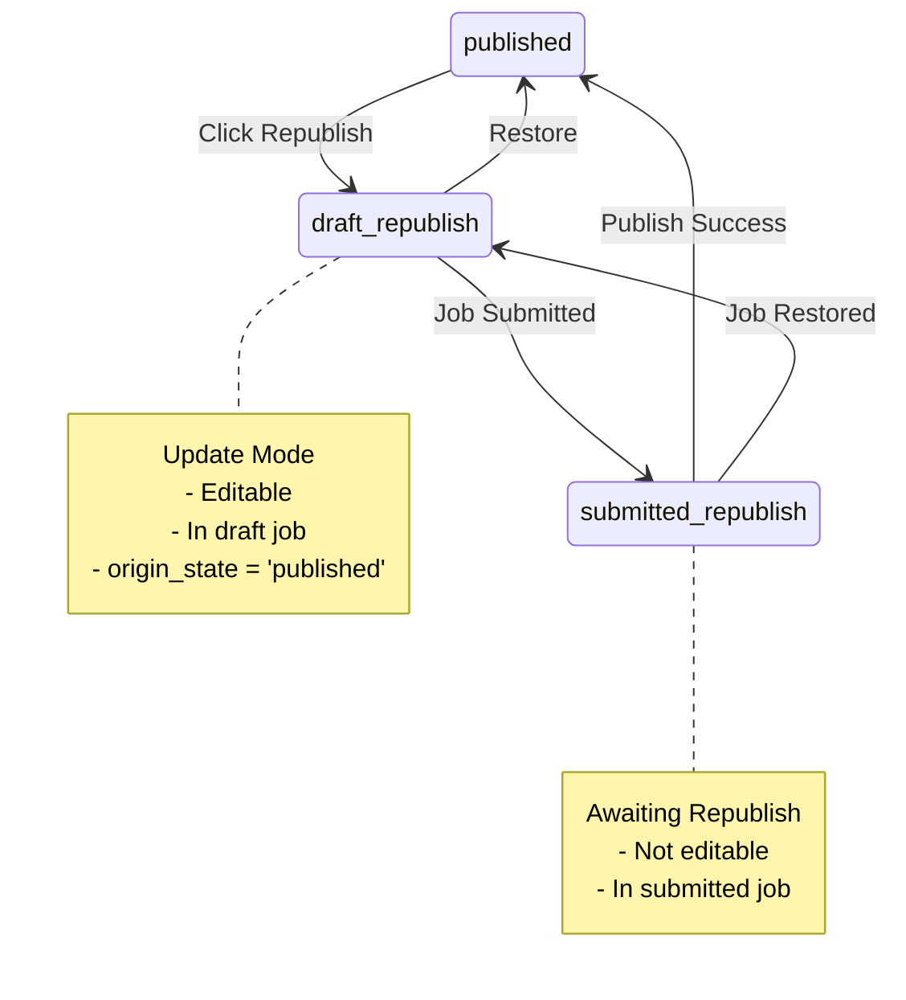

## Republish Workflow (from Unpublished)

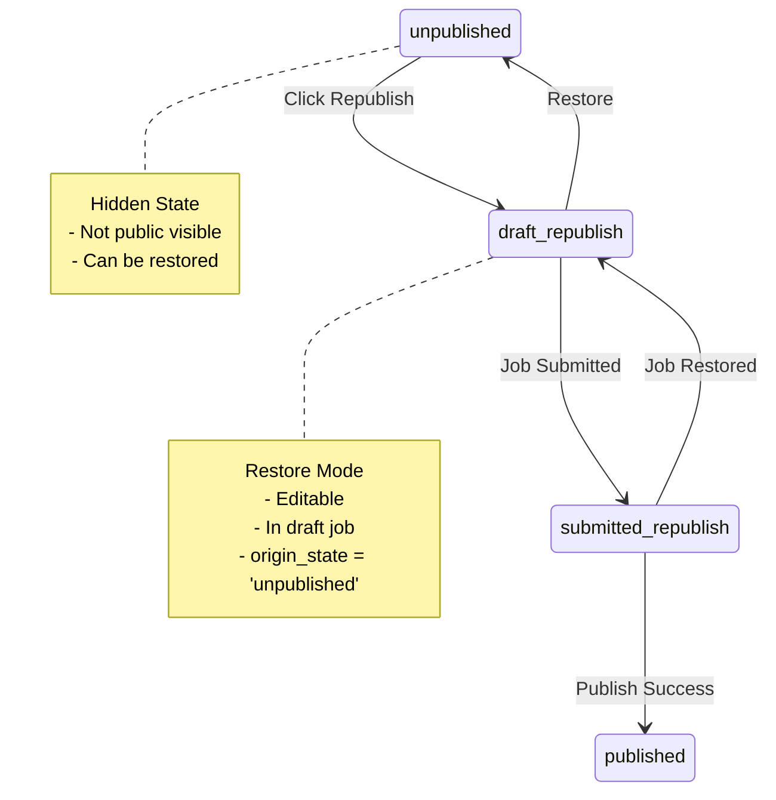

## Unpublish Workflow

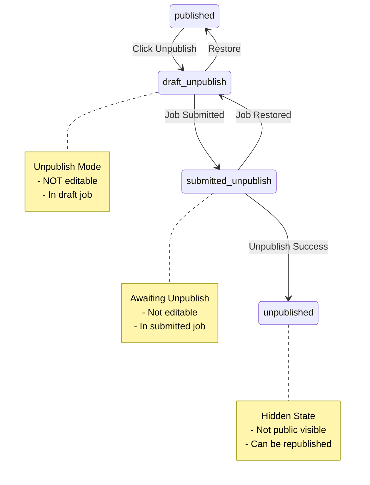

## Complete Job State Diagram

This diagram shows all possible state transitions for jobs in the V2 state machine.

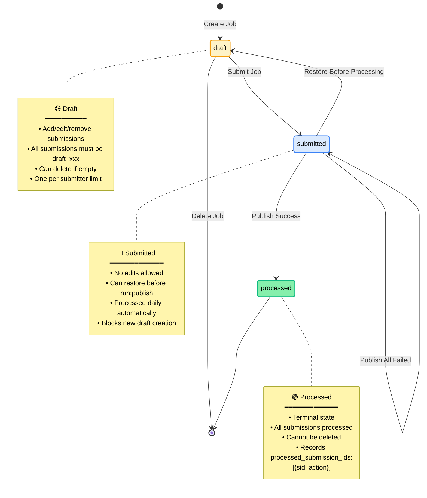

## Job State with Failure Handling

## Submission Lifecycle by Action

### Create New Submission

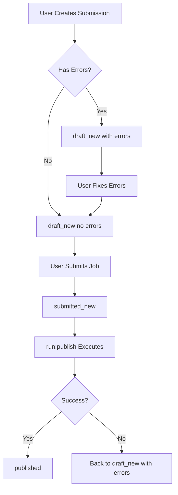

### Republish Existing Submission

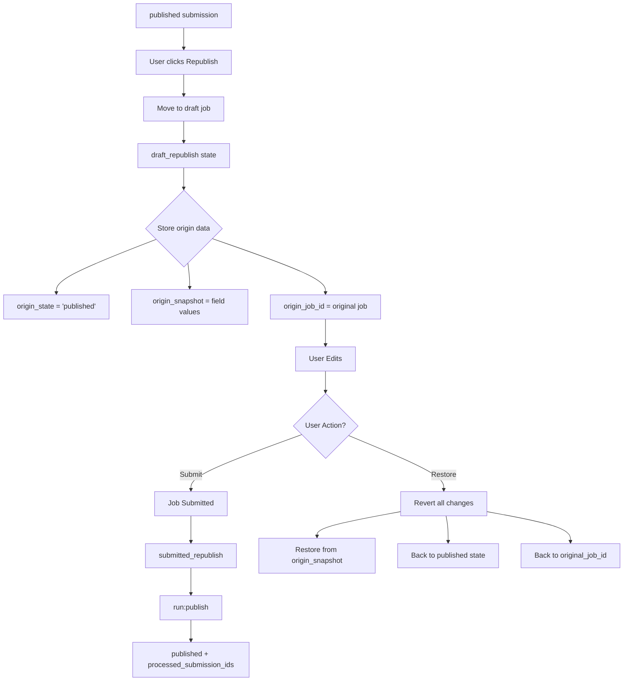

### Unpublish Submission

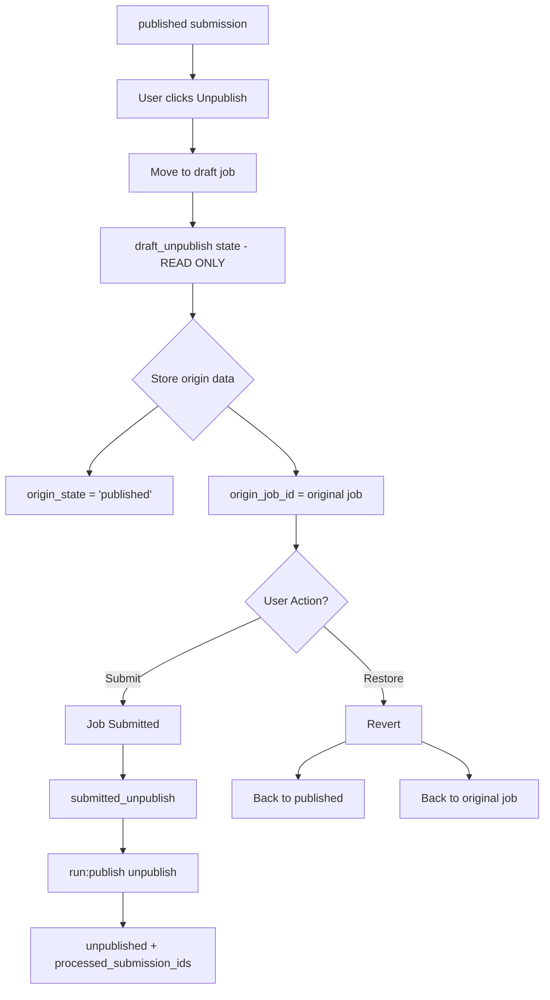

## Job Lifecycle

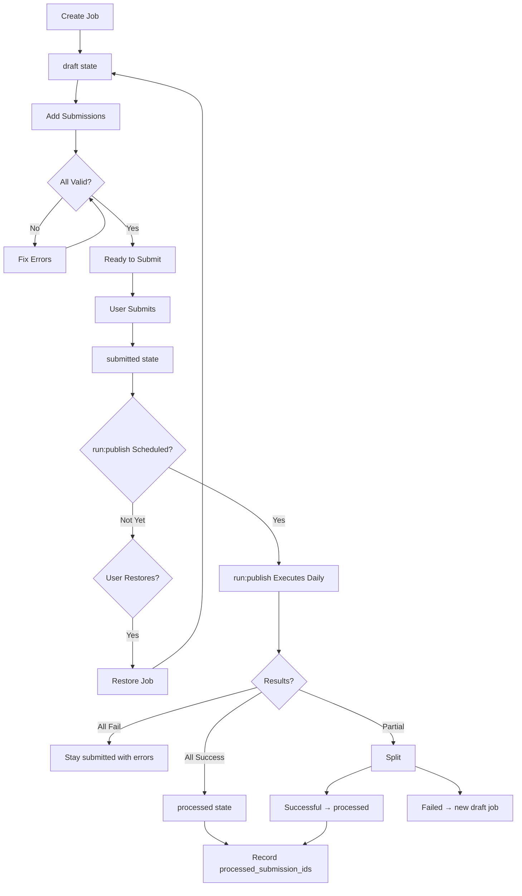

## State Transition Matrix

### Submission States

| From State | To State(s) | Trigger | Validation |
|------------|------------|---------|------------|
| `draft_new` | `submitted_new` | Job submitted | No errors |
| `draft_new` | DELETED | User deletes | In draft job |
| `submitted_new` | `published` | run:publish success | - |
| `submitted_new` | `draft_new` | Job restored | Before run:publish |
| `published` | `draft_republish` | User republishes | - |
| `published` | `draft_unpublish` | User unpublishes | - |
| `draft_republish` | `submitted_republish` | Job submitted | No errors |
| `draft_republish` | `published` | User restores | origin_state='published' |
| `draft_republish` | `unpublished` | User restores | origin_state='unpublished' |
| `submitted_republish` | `published` | run:publish success | - |
| `submitted_republish` | `draft_republish` | Job restored | Before run:publish |
| `draft_unpublish` | `submitted_unpublish` | Job submitted | - |
| `draft_unpublish` | `published` | User restores | - |
| `submitted_unpublish` | `unpublished` | run:publish success | - |
| `submitted_unpublish` | `draft_unpublish` | Job restored | Before run:publish |
| `unpublished` | `draft_republish` | User republishes | - |

### Job States

| From State | To State(s) | Trigger | Validation |
|------------|------------|---------|------------|
| `draft` | `submitted` | User submits | All submissions valid, no errors |
| `draft` | DELETED | User deletes | Can delete if empty or only draft submissions |
| `submitted` | `processed` | run:publish success | At least one submission succeeds |
| `submitted` | `submitted` | run:publish failure | All submissions fail |
| `submitted` | `draft` | User restores | Before run:publish starts |

### Job Processing Actions

When a job transitions to `processed` state, the following data is recorded:

- **processed_submission_ids**: Array of objects tracking each processed submission
  - Structure: `[{"sid": "SGC-12345", "action": "published|republished|unpublished"}]`
  - Actions:
    - `published`: New submission (submitted_new → published)
    - `republished`: Updated submission (submitted_republish → published)
    - `unpublished`: Removed submission (submitted_unpublish → unpublished)
- This data persists even if submissions are moved to other jobs

## Color Coding Guide

Actual implementation uses the following color scheme:

### Submission States (Tag Colors)
- `draft_new`: **Light Orange** (#FEF3C7) - New submission in draft
- `submitted_new`: **Light Blue** (#DBEAFE) - New submission processing
- `published`: **Green** (#86EFAC) - Live/active submission
- `draft_republish`: **Medium Orange** (#FDE68A) - Editing published submission
- `submitted_republish`: **Medium Blue** (#BFDBFE) - Update processing
- `draft_unpublish`: **Dark Orange** (#FBBF24) - Pending removal (read-only)
- `submitted_unpublish`: **Dark Blue** (#60A5FA) - Unpublish processing
- `unpublished`: **Dark Gray** (#3F3F46) - Removed/hidden

### Submission Row Colors
- **Normal**: White background (#ffffff)
- **With Errors**: Light red background (#fef2f2)
- Error indicator: Red warning triangle icon

### Job States
- `draft`: **Orange/Yellow** tag - Work in progress
- `submitted`: **Blue** tag - Awaiting daily processing
- `processed`: **Green** tag - Completed processing

### Job Header Colors (Detail View)
- `draft`: Yellow header (bg-yellow-500)
- `submitted`: Blue header (bg-blue-500)
- `processed`: Green header (bg-green-500)

## Icon Recommendations

### Submission Actions (Actual Implementation)
- **Create New**: Not specific icon, part of job creation
- **Edit (Republish)**: `pi-pencil` (pencil icon)
- **Unpublish**: `pi-eye-slash` (eye-slash icon)
- **Restore**: `pi-times-circle` (times-circle icon) - Used for cancel/restore
- **View/Edit**: `pi-arrow-right` (arrow icon)
- **Submit Job**: Button with "Submit" text
- **Delete**: `pi-trash`

### Submission Error Indicators
- **Has Errors**: `pi-exclamation-triangle` (red warning triangle)

### Job Error Indicators
- **Draft with Errors**: `pi-exclamation-triangle` (red warning triangle in status column)

## Glossary

- **Draft State** (`draft_xxx`): Submission can be edited (except draft_unpublish), belongs to a draft job
- **Submitted State** (`submitted_xxx`): Submission locked, awaiting run:publish processing
- **Terminal State**: Final state that cannot transition (except `published` and `unpublished` which can be republished)
- **Origin State** (`origin_state`): Stored state for restore operations (published/unpublished)
- **Origin Snapshot** (`origin_snapshot`): JSON snapshot of all editable field values before entering draft_republish or draft_unpublish state
- **Origin Job** (`origin_job_id`): Foreign key to the job the submission belonged to before being moved to a draft job
- **Processed Submission IDs** (`processed_submission_ids`): Array tracking which submissions were processed by a job with their action type
- **run:publish**: Backend command that processes submitted jobs daily and publishes to GenCC-Search
- **Restore**: Action to cancel draft changes and return submission to its original state, job, and field values
- **Republish**: Action to edit and re-publish an already published submission
- **Unpublish**: Action to remove a published submission from public view

---

## Related Documentation

- [STATE_MODEL_USER_GUIDE.md](STATE_MODEL_USER_GUIDE.md) - User-friendly guide with simple visual workflows
- [STATE_MODEL_QUICK_REFERENCE.md](STATE_MODEL_QUICK_REFERENCE.md) - Technical reference with code examples
- [DASHBOARD_TECHNICAL_GUIDE.md](DASHBOARD_TECHNICAL_GUIDE.md) - Dashboard implementation details

---

**Version**: 2.0
**Last Updated**: November 13, 2025
